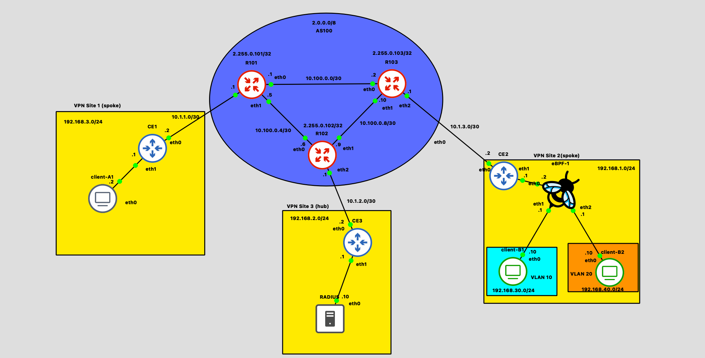

# NSD Project

This is the final project for the **Network and System Defence** class, academic year 2025/26.

The project implements a multi-site network with an AS100 routing core (FRR, OSPF + iBGP),
a VPN hub-and-spoke overlay over OpenVPN, network access control with **802.1X** and
in-kernel enforcement with **eBPF/XDP** (RADIUS-driven MAC/VLAN authorization), and
**AppArmor** Mandatory Access Control hardening for the sensitive client of Site 1.

## Topology network



## AS100

In AS100 we have three provider routers (**R101**, **R102**, **R103**). Each router runs
OSPF area 0 as IGP on all core links, on the links towards the customer edges and on the
loopback; an **iBGP full mesh** is established between the loopbacks
(`2.255.0.10x/32`) with `update-source` and `next-hop-self`, so the BGP sessions do not
depend on the physical topology.

### R101

###### `init.sh`

Interfaces and addressing are configured with `ip`, then OSPF and BGP are pushed to FRR
through a single `vtysh` session:

```bash
#!/bin/bash

set -eu

ip link set eth0 up
ip link set eth1 up
ip link set eth2 up
ip link set lo up


ip addr add 10.100.0.1/30 dev eth0
ip addr add 10.100.0.5/30 dev eth1
ip addr add 10.1.1.1/30 dev eth2


ip addr add 2.255.0.101/32 dev lo


vtysh <<'VTY'
configure terminal
hostname R101
service integrated-vtysh-config

interface lo
    ip address 2.255.0.101/32
interface eth0
    ip address 10.100.0.1/30
interface eth1
    ip address 10.100.0.5/30
interface eth2
    ip address 10.1.1.1/30
router ospf
    ospf router-id 2.255.0.101
    network 2.255.0.101/32 area 0
    network 10.100.0.0/30 area 0
    network 10.100.0.4/30 area 0
    network 10.1.1.0/30 area 0
exit

router bgp 100
    bgp router-id 2.255.0.101
    neighbor 2.255.0.102 remote-as 100
    neighbor 2.255.0.102 update-source 2.255.0.101 
    neighbor 2.255.0.103 remote-as 100
    neighbor 2.255.0.103 update-source 2.255.0.101

    address-family ipv4 unicast
        neighbor 2.255.0.102 next-hop-self
        neighbor 2.255.0.103 next-hop-self
    exit-address-family
exit
end
write memory

VTY

echo "Initialization completed."
```

### R102

###### `init.sh`

Same scheme, loopback `2.255.0.102/32`, core links `10.100.0.6/30` (to R101) and
`10.100.0.9/30` (to R103), customer link `10.1.2.1/30` towards CE3:

```bash
#!/bin/bash

set -eu

ip link set eth0 up
ip link set eth1 up
ip link set eth2 up
ip link set lo up


ip addr add 10.100.0.6/30 dev eth0
ip addr add 10.100.0.9/30 dev eth1
ip addr add 10.1.2.1/30 dev eth2


ip addr add 2.255.0.102/32 dev lo


vtysh <<'VTY'
configure terminal
hostname R102
service integrated-vtysh-config

interface lo
    ip address 2.255.0.102/32
interface eth0
    ip address 10.100.0.6/30
interface eth1
    ip address 10.100.0.9/30
interface eth2
    ip address 10.1.2.1/30
router ospf
    ospf router-id 2.255.0.102
    network 2.255.0.102/32 area 0
    network 10.100.0.4/30 area 0
    network 10.100.0.8/30 area 0
    network 10.1.2.0/30 area 0
exit

router bgp 100
    bgp router-id 2.255.0.102
    neighbor 2.255.0.101 remote-as 100
    neighbor 2.255.0.101 update-source 2.255.0.102
    neighbor 2.255.0.103 remote-as 100
    neighbor 2.255.0.103 update-source 2.255.0.101

    address-family ipv4 unicast
        neighbor 2.255.0.101 next-hop-self
        neighbor 2.255.0.103 next-hop-self
    exit-address-family
exit
end
write memory

VTY

echo "Initialization completed."
```

### R103

###### `init.sh`

Same scheme, loopback `2.255.0.103/32`, core links `10.100.0.2/30` (to R101) and
`10.100.0.10/30` (to R102), customer link `10.1.3.1/30` towards CE2:

```bash
#!/bin/bash

set -eu

ip link set eth0 up
ip link set eth1 up
ip link set eth2 up
ip link set lo up


ip addr add 10.100.0.2/30 dev eth0
ip addr add 10.100.0.10/30 dev eth1
ip addr add 10.1.3.1/30 dev eth2


ip addr add 2.255.0.103/32 dev lo


vtysh <<'VTY'
configure terminal
hostname R103
service integrated-vtysh-config

interface lo
    ip address 2.255.0.103/32
interface eth0
    ip address 10.100.0.2/30
interface eth1
    ip address 10.100.0.10/30
interface eth2
    ip address 10.1.3.1/30
router ospf
    ospf router-id 2.255.0.103
    network 2.255.0.103/32 area 0
    network 10.100.0.0/30 area 0
    network 10.100.0.8/30 area 0
    network 10.1.3.0/30 area 0
exit

router bgp 100
    bgp router-id 2.255.0.103
    neighbor 2.255.0.101 remote-as 100
    neighbor 2.255.0.101 update-source 2.255.0.103
    neighbor 2.255.0.102 remote-as 100
    neighbor 2.255.0.102 update-source 2.255.0.103

    address-family ipv4 unicast
        neighbor 2.255.0.101 next-hop-self
        neighbor 2.255.0.102 next-hop-self
    exit-address-family
exit
end
write memory

VTY

echo "Initialization completed."
```

## VPN Site 1

Site 1 hosts the sensitive client: CE1 is the customer edge, `client-A1` runs on the LAN
`192.168.3.0/24` and is protected with a custom AppArmor profile in enforce mode.

### CE1

###### `init.sh`

WAN link towards R101 (`10.1.1.2/30`), LAN gateway (`192.168.3.1/24`), IPv4 forwarding:

```bash
#!/bin/bash
set -eu

ip link set eth0 up
ip link set eth1 up

ip addr add 10.1.1.2/30 dev eth0
ip addr add 192.168.3.1/24 dev eth1

#enable IPv4 forwarding

sysctl -w net.ipv4.ip_forward=1 >/dev/null 2>&1

ip route add default via 10.1.1.1
```

###### `client.conf`

OpenVPN spoke towards the hub CE3 (reachable at `10.1.2.2` through the AS100 core),
certificate-based authentication with AES-256-GCM:

```ini
client
dev tun
proto udp

remote 10.1.2.2 1194

ca /root/openvpn/keys/ca.crt
cert /root/openvpn/keys/CE1.crt
key /root/openvpn/keys/CE1.key

remote-cert-tls server
persist-key
persist-tun
verb 3
cipher AES-256-GCM
```

### client-A1

`client-A1` is the *sensitive* device of the topology, protected with Mandatory Access
Control. The confined program is **`python3 /opt/client-a1/app.py`**, an HTTP service
exposed on the LAN: as the only network-facing service of the device it is the primary
attack surface, and confining it limits the damage of a potential compromise (the process
remains bound to the permissions of the profile). The image is a custom build of the
course base image: AppArmor is a kernel LSM, so the container only ships the userspace
tools (parser and utilities) while enforcement is provided by the host kernel shared by
the privileged container.

The profile implements **four of the five security objectives** of the assignment:

| # | Objective | Rule |
|---|---|---|
| 1 | deny reads of OS credential stores | `deny /etc/shadow r,` (+ shadow-, gshadow) |
| 3 | deny writes to /etc (config integrity) | `deny /etc/** w,` |
| 4 | deny execution from world-writable paths | `deny /tmp/** x,` (+ /var/tmp, /dev/shm) |
| 5 | restrict network access to what is required | `network inet stream,` (deny-by-default for UDP/ICMP/raw) |

The profile is a **named** profile entered with `aa-exec -p` (deterministic attachment to
the single service instead of confining every `python3` on the node); explicit `deny`
rules always override any allow inherited from the included abstractions.

###### `Dockerfile`

```dockerfile
FROM nsdcourse/basenet:latest

# strumenti userspace AppArmor (l'enforcement resta a carico del kernel
# della VM host, condiviso dal container) + utility di montaggio
RUN apt-get update && apt-get install -y --no-install-recommends \
        apparmor \
        apparmor-utils \
        util-linux \
        curl \
    && rm -rf /var/lib/apt/lists/*

# servizio da confinare + dati
COPY app/app.py /opt/client-a1/app.py
COPY data/status.txt /opt/client-a1/data/status.txt

# profilo AppArmor (verra' caricato in enforce da init.sh)
COPY apparmor/client-a1-app /etc/apparmor.d/client-a1-app

COPY init.sh /root/init.sh
RUN chmod +x /root/init.sh && mkdir -p /var/log /opt/client-a1/data
```

###### `init.sh`

Mounts securityfs (not mounted by default in containers), loads/reloads the profile with
`apparmor_parser -r` (enforce is the parser default), starts the service confined with
`aa-exec -p` and saves `aa-status` as evidence:

```bash
#!/bin/sh
# client-A1 (Site 1) — avvio del servizio con AppArmor in enforce mode
set -eu


ip link set lo up
ip link set eth0 up

ip addr add 192.168.3.2/24 dev eth0

# securityfs non e' montata nei container di default: serve per parlare
# con il LSM del kernel (il nodo GNS3 e' privileged)
if [ ! -d /sys/kernel/security/apparmor ]; then
    mount -t securityfs securityfs /sys/kernel/security
fi

# carica/aggiorna il profilo: il parser carica in ENFORCE di default
# (-r = replace: ricarica anche se il profilo esiste gia')
apparmor_parser -r /etc/apparmor.d/client-a1-app

# avvia il servizio CONFINATO nel profilo nominato
mkdir -p /var/log
(aa-exec -p client-a1-app -- python3 /opt/client-a1/app.py \
    >> /var/log/client-a1-app.log 2>&1 &)

# evidenza per il report (AppArmor enabled and active)
aa-status > /root/aa-status.txt || true

echo "[client-A1] profilo 'client-a1-app' caricato (enforce), servizio su :8080"
```

###### `apparmor/client-a1-app`

```text
# Profilo AppArmor per il servizio HTTP di client-A1 (Site 1).
#
# Programma confinato: python3 /opt/client-a1/app.py — servizio esposto di
# rete su un dispositivo "sensitive" (traccia NSD 2025-26, VPN Site 1).
#
# Obiettivi di sicurezza implementati:
#   (1) deny lettura credenziali OS           -> /etc/shadow, /etc/shadow-, /etc/gshadow
#   (3) deny scrittura in /etc                -> integrita' della configurazione
#   (4) deny esecuzione da world-writable     -> /tmp, /var/tmp, /dev/shm
#   (5) rete limitata al necessario           -> solo TCP IPv4 (deny-by-default
#                                                 per UDP/ICMP/raw)
#
# I rule "deny" prevalgono sempre su qualunque allow ereditato dalle
# astrazioni incluse. Profilo nominato: si entra con aa-exec -p client-a1-app.

#include <tunables/global>

profile client-a1-app flags=(attach_disconnected) {
  #include <abstractions/base>

  # interprete e applicazione
  /usr/bin/python3* mr,
  /usr/lib/python3*/** r,
  /usr/local/lib/python3*/** r,
  /opt/client-a1/app.py r,

  # i propri dati: unica area con scrittura concessa
  /opt/client-a1/data/ r,
  /opt/client-a1/data/** rw,

  # informazioni di runtime usate da python
  /proc/sys/kernel/random/boot_id r,
  /sys/devices/system/cpu/online r,

  # --- obiettivo (1): credenziali OS ---
  deny /etc/shadow r,
  deny /etc/shadow- r,
  deny /etc/gshadow r,

  # --- obiettivo (3): integrita' di /etc ---
  deny /etc/** w,

  # --- obiettivo (4): niente esecuzione da path world-writable ---
  deny /tmp/** x,
  deny /var/tmp/** x,
  deny /dev/shm/** x,

  # --- obiettivo (5): solo il traffico di servizio ---
  network inet stream,
}
```

###### `app/app.py`

The `/secrets` and `/etcwrite` endpoints are explicit test hooks simulating the first
actions of a compromised process (reading the OS credential store, tampering with the
system configuration): with the profile active they produce the DENIED audit lines used
as log evidence.

```python
#!/usr/bin/env python3
"""Servizio HTTP di client-A1 (Site 1).

Programma scelto per il confinamento AppArmor: un servizio esposto di rete su
un dispositivo "sensitive" (traccia NSD 2025-26, VPN Site 1). Gli endpoint
/secrets e /etcwrite sono hook di test espliciti che simulano le prime azioni
tipiche di un processo compromesso: leggere lo store di credenziali del sistema
e manomettere la configurazione. Sotto profilo attivo producono le righe di
DENIED per l'evidenza del report.

Esecuzione confinata (da init.sh):
    aa-exec -p client-a1-app -- python3 /opt/client-a1/app.py
"""

import os
from http.server import BaseHTTPRequestHandler, HTTPServer

DATA_DIR = "/opt/client-a1/data"
STATUS_FILE = os.path.join(DATA_DIR, "status.txt")
PORT = 8080


class Handler(BaseHTTPRequestHandler):
    def _send(self, code, html):
        body = html.encode()
        self.send_response(code)
        self.send_header("Content-Type", "text/html; charset=utf-8")
        self.send_header("Content-Length", str(len(body)))
        self.end_headers()
        self.wfile.write(body)

    def _page(self, title, lines):
        rows = "".join("<li>{}</li>".format(l) for l in lines)
        return ("<html><head><title>{}</title></head><body><h1>{}</h1>"
                "<ul>{}</ul></body></html>".format(title, title, rows))

    def do_GET(self):
        if self.path == "/":
            # azione CONSENTITA: il servizio legge solo i propri dati
            try:
                with open(STATUS_FILE) as f:
                    status = f.read().strip()
            except OSError as e:
                self._send(500, self._page("client-A1",
                                           ["errore lettura stato: {}".format(e)]))
                return
            self._send(200, self._page("client-A1", [
                "stato: {}".format(status),
                "profilo AppArmor attivo: client-a1-app (enforce)",
            ]))

        elif self.path == "/secrets":
            # azione VIETATA (obiettivo 1: credenziali OS)
            try:
                with open("/etc/shadow") as f:
                    f.read()
                # raggiunto SOLO se il profilo non e' attivo: segnalarlo
                self._send(200, self._page("client-A1", [
                    "ATTENZIONE: /etc/shadow LEGGIBILE — profilo non attivo!",
                ]))
            except OSError as e:
                self._send(500, self._page("Accesso negato",
                                           ["/etc/shadow: {}".format(e)]))

        elif self.path == "/etcwrite":
            # azione VIETATA (obiettivo 3: integrita' di /etc)
            try:
                with open("/etc/client-a1-pwned", "w") as f:
                    f.write("compromesso\n")
                self._send(200, self._page("client-A1", [
                    "ATTENZIONE: scrittura in /etc RIUSCITA — profilo non attivo!",
                ]))
            except OSError as e:
                self._send(500, self._page("Scrittura negata",
                                           ["/etc/client-a1-pwned: {}".format(e)]))

        else:
            self._send(404, "<html><body><h1>404</h1></body></html>")

    def log_message(self, fmt, *args):
        print("[client-a1-app]", self.address_string(), fmt % args, flush=True)


def main():
    srv = HTTPServer(("0.0.0.0", PORT), Handler)
    print("[client-a1-app] in ascolto su :{}".format(PORT), flush=True)
    srv.serve_forever()


if __name__ == "__main__":
    main()
```

Reproducible tests: `curl http://127.0.0.1:8080/` succeeds (allowed action, the service
reads its own data), while `/secrets` and `/etcwrite` fail with `Permission denied`
(forbidden actions). Evidence: `aa-status` shows `client-a1-app (enforce)` and
`dmesg | grep -i apparmor | grep -i DENIED` shows the kernel audit lines (in containers
there is no journalctl: the LSM audit messages land in the kernel ring buffer, the
probatory equivalent declared in the delivery).

## VPN Site 3

Site 3 is the VPN **hub**: CE3 terminates the OpenVPN tunnels of the spokes, generates
the PKI with easy-rsa and is the gateway of the LAN hosting the RADIUS server.

### CE3

###### `init.sh`

WAN link towards R102 (`10.1.2.2/30`), LAN gateway towards RADIUS (`192.168.2.1/24`):

```bash
#!/bin/bash

set -eu

ip link set eth0 up
ip link set eth1 up

ip addr add 10.1.2.2/30 dev eth0
ip addr add 192.168.2.1/24 dev eth1

sysctl -w net.ipv4.ip_forward=1 >/dev/null 2>&1

ip route add default via 10.1.2.1
```

###### `pki-gen.sh`

Idempotent PKI generation (CA, server certificate, client certificates CE1/CE2, DH
parameters) with easy-rsa; artifacts are exported for the spokes:

```bash
#!/bin/bash
set -eu

CA_CN="${CA_CN:-NSD_project}"
EASYRSA_DIR="/usr/share/easy-rsa"
OPENVPN_BASE="/root/openvpn"
SERVER_NAME="CE3"
CLIENTS="CE1 CE2"

PKI_DIR="${EASYRSA_DIR}/pki"

cd "${EASYRSA_DIR}"

if [ -d "${PKI_DIR}" ] && [ -f "${PKI_DIR}/ca.crt" ] && [ -f "${PKI_DIR}/issued/${SERVER_NAME}.crt" ] && [ -f "${PKI_DIR}/private/${SERVER_NAME}.key" ]; then
    echo "PKI directory already exists. Skipping PKI generation."
else
    export EASYRSA_BATCH=1
    export EASYRSA_REQ_CN="${CA_CN}"

    ./easyrsa init-pki
    ./easyrsa build-ca nopass
    ./easyrsa build-server-full "${SERVER_NAME}" nopass

    for CLIENT in ${CLIENTS}; do
        ./easyrsa build-client-full "${CLIENT}" nopass
    done

    ./easyrsa gen-dh
fi

mkdir -p "${OPENVPN_BASE}/keys" "${OPENVPN_BASE}/export/CE1" "${OPENVPN_BASE}/export/CE2"

cp -f "${PKI_DIR}/ca.crt" "${OPENVPN_BASE}/keys/ca.crt"
cp -f "${PKI_DIR}/issued/${SERVER_NAME}.crt" "${OPENVPN_BASE}/keys/${SERVER_NAME}.crt"
cp -f "${PKI_DIR}/private/${SERVER_NAME}.key" "${OPENVPN_BASE}/keys/${SERVER_NAME}.key"
cp -f "${PKI_DIR}/dh.pem" "${OPENVPN_BASE}/keys/dh.pem"


for CLIENT in ${CLIENTS}; do
    mkdir -p "${OPENVPN_BASE}/export/${CLIENT}"
    cp -f "${PKI_DIR}/ca.crt" "${OPENVPN_BASE}/export/${CLIENT}/ca.crt"
    cp -f "${PKI_DIR}/issued/${CLIENT}.crt" "${OPENVPN_BASE}/export/${CLIENT}/${CLIENT}.crt"
    cp -f "${PKI_DIR}/private/${CLIENT}.key" "${OPENVPN_BASE}/export/${CLIENT}/${CLIENT}.key"
done

echo "PKI generation completed. Certificates and keys are stored in ${OPENVPN_BASE}/keys and ${OPENVPN_BASE}/export."
```

###### `server.conf`

Hub configuration: tunnel network `192.168.100.0/24`, `client-to-client` for
spoke-to-spoke traffic through the hub, per-client CCD and static routes/pushed routes
for every site LAN:

```ini
port 1194
proto udp
dev tun

ca /root/openvpn/ca.crt
cert /root/openvpn/CE3.crt
key /root/openvpn/CE3.key
dh /root/openvpn/dh.pem

server 192.168.100.0 255.255.255.0


push "route 192.168.1.0 255.255.255.0"
push "route 192.168.3.0 255.255.255.0"
push "route 192.168.30.0 255.255.255.0"
push "route 192.168.40.0 255.255.255.0"

client-to-client

client-config-dir /root/openvpn/ccd


route 192.168.1.0 255.255.255.0
route 192.168.3.0 255.255.255.0
route 192.168.30.0 255.255.255.0
route 192.168.40.0 255.255.255.0

keepalive 10 120
persist-key
persist-tun
verb 3
cipher AES-256-GCM
```

### RADIUS

FreeRADIUS authorizes the supplicants and **assigns the VLAN** through
`Tunnel-Private-Group-Id` (attribute 81): user `b1` → VLAN 10, user `b2` → VLAN 20. The
only authorized NAS is the eBPF-1 authenticator (`192.168.1.2`, shared secret
`testing123`).

###### `init.sh`

Installs the configuration into `/etc/freeradius/3.0/` (`users.conf` becomes the
`authorize` file), restarts the daemon and verifies listening on UDP/1812:

```bash
#!/bin/bash

set -eu

ip link set eth0 up

ip addr add 192.168.2.10/24 dev eth0 2>/dev/null 2>&1 || true
ip route add default via 192.168.2.1 2>/dev/null 2>&1 || true

RDIR="/etc/freeradius/3.0"

mkdir -p $RDIR/mods-config/files

if [ -f /root/freeradius/clients.conf ]; then
    cp /root/freeradius/clients.conf $RDIR/clients.conf
    cp /root/freeradius/users.conf $RDIR/mods-config/files/authorize
else
    echo "clients.conf or users.conf not found in /root/freeradius"
    exit 1
fi

if [ -f /root/freeradius/users.conf ]; then
    cp /root/freeradius/users.conf $RDIR/users.conf
else
    echo "users.conf not found in /root/freeradius"
    exit 1
fi

pkill -x freeradius >/dev/null 2>&1 || true
pkill -x radiusd >/dev/null 2>&1 || true


if command -v freeradius >/dev/null 2>&1; then
    (freeradius -f -l /root/radius.log >/dev/null 2>&1 &)
else
    (radiusd -f -l /root/radius.log >/dev/null 2>&1 &)
fi

sleep 1

echo "RADIUS listening on UDP port 1812:"
ss -lunp | grep ':1812' || echo "RADIUS is not listening on UDP port 1812"

echo "Last FreeRadius log entries:"
tail -n 30 "/root/radius.log" 2>/dev/null || true
```

###### `clients.conf`

```ini
client ebpfSwitch {
    ipaddr = 192.168.1.2
    secret = testing123
    shortname = eBPF-1
}
```

###### `users.conf`

```ini
b1  Cleartext-Password := "b1Password"
    Service-Type = Framed-User,
    Tunnel-Type = 13,
    Tunnel-Medium-Type = 6,
    Tunnel-Private-Group-Id = "10"


b2  Cleartext-Password := "b2Password"
    Service-Type = Framed-User,
    Tunnel-Type = 13,
    Tunnel-Medium-Type = 6,
    Tunnel-Private-Group-Id = "20"
```

## VPN Site 2

Site 2 hosts the 802.1X access network: CE2 is the customer edge and the VLAN
terminator, **eBPF-1** is the authenticator switch with the eBPF enforcement system, and
`Client-B1` / `Client-B2` are the supplicants (VLAN 10 / VLAN 20).

### CE2

###### `init.sh`

WAN link towards R103 (`10.1.3.2/30`), LAN gateway towards eBPF-1 (`192.168.1.1/24`),
and the **VLAN subinterfaces** that terminate the authenticated users' networks:
`eth1.10` (VLAN 10) and `eth1.20` (VLAN 20) receive the tagged traffic from the eBPF-1
uplink:

```bash
set -eu

ip link set eth0 up
ip link set eth1 up

ip addr add 10.1.3.2/30 dev eth0
ip addr add 192.168.1.1/24 dev eth1

sysctl -w net.ipv4.ip_forward=1 >/dev/null 2>&1

ip route add default via 10.1.3.1


ip link show eth1.10 > /dev/null 2>&1 || ip link add link eth1 name eth1.10 type vlan id 10
ip link set eth1.20 >/dev/null 2>&1 || ip link add link eth1 name eth1.20 type vlan id 20

ip link set eth1.10 up
ip link set eth1.20 up

ip addr add 192.168.30.1/30 dev eth1.10
ip addr add 192.168.40.1/30 dev eth1.20
```

###### `client.conf`

```ini
client
dev tun
proto udp

remote 10.1.2.2 1194

ca /root/openvpn/keys/ca.crt
cert /root/openvpn/keys/CE2.crt
key /root/openvpn/keys/CE2.key

remote-cert-tls server
persist-key
persist-tun
verb 3
cipher AES-256-GCM
```

### eBPF-1

eBPF-1 is a Linux bridge switch acting as **802.1X authenticator** (hostapd, driver
`wired`) and running the **eBPF/XDP enforcement system**. The design decision at the
core of the project: the supplicant MAC is **never parsed as a string inside eBPF**
(string parsing in BPF is fragile against the verifier). Instead:

1. **`xdp_eap`** (attached on eth1/eth2, the client ports) sees EAPOL frames before the
   bridge: from the *EAP Response/Identity* it extracts the identity and from the
   Ethernet frame the **source MAC** (a plain 6-byte copy), recording
   `identity_map[identity] = {MAC, ingress port, timestamp}`. Claims have a **15 s TTL**
   and are consumed **one-shot** (replay-resistant); EAPOL-Logoff marks the station to
   be revoked.
2. **`xdp_radius_parse`** (attached on eth0, the uplink) sees the RADIUS
   **Access-Accept** messages, extracts `User-Name` (attr 1) and
   `Tunnel-Private-Group-Id` (attr 81), correlates them with the EAPOL claim and writes
   `auth_map[MAC] = {VLAN, state, enforced, ingress port}`.
3. **`xdp_user`** (userspace, C + libbpf) polls the pinned map and applies the L2
   enforcement: `bridge vlan add` (pvid untagged on the client port, tagged on the
   uplink) plus symmetric per-MAC `ebtables` rules; on logoff everything is revoked.
   The client port is **not statically configured**: it comes from the EAPOL ingress
   ifindex recorded in the claim (`if_indextoname`), i.e. the ground truth is the wire.
   Additional design choices: periodic sweep of expired claims, clean shutdown on
   SIGINT/SIGTERM, idempotent ebtables rules (`-C` check before `-A`).

The whole design is fail-closed: without authentication no L2 rule allows client traffic.

###### `init.sh`

Linux bridge with VLAN filtering (trunk to CE2, access ports to clients), EAPOL
forwarding enabled through the bridge, default-deny ebtables baseline, hostapd startup:

```bash
#!/bin/bash

set -eu

ip link add bridge0 type bridge vlan_filtering 1

ip link set eth0 master bridge0
ip link set eth1 master bridge0
ip link set eth2 master bridge0

ip link set lo up
ip link set eth0 up
ip link set eth1 up
ip link set eth2 up
ip link set bridge0 up

echo 8 > /sys/class/net/bridge0/bridge/group_fwd_mask

ip addr add 192.168.1.2/24 dev bridge0
ip route add default via 192.168.1.1

ebtables -F
ebtables -P FORWARD DROP
ebtables -P INPUT ACCEPT
ebtables -P OUTPUT ACCEPT

ebtables -A FORWARD -i eth0 -j ACCEPT

if ! pgrep -x hostapd >/dev/null 2>&1; then
    mkdir -p /var/run/hostapd
    hostapd -B /etc/hostapd/hostapd.conf
fi

echo "[eBPF-1] Initialization complete."
```

###### `xdp_radius/Makefile`

Builds both XDP objects and the two userspace binaries, reusing the xdp-tutorial common
infrastructure (clang/libbpf/libxdp):

```makefile
# SPDX-License-Identifier: (GPL-2.0 OR BSD-2-Clause)

XDP_TARGETS  := xdp_prog_kern xdp_eap
USER_TARGETS := xdp_loader xdp_user

COMMON_DIR := ../common
COMMON_OBJS := $(COMMON_DIR)/common_user_bpf_xdp.o

LDLIBS += -lbpf

include $(COMMON_DIR)/common.mk
```

###### `xdp_radius/load_ebpf.sh`

Mounts bpffs, cleans stale pinned maps, detaches previous XDP programs, attaches
`xdp_radius_parse` on eth0 and `xdp_eap_parse` on eth1/eth2 (maps are pinned under
`/sys/fs/bpf/` thanks to `LIBBPF_PIN_BY_NAME`), then runs the enforcer in foreground:

```bash
#!/usr/bin/env bash
set -euo pipefail

# Carica i due programmi XDP e avvia l'enforcer userspace (xdp_user).
# Topologia deployata del corso (diversa dalla repo di riferimento):
#   bridge0   = bridge con vlan_filtering (init.sh del nodo)
#   eth0      = uplink verso CE2  -> parser RADIUS  (xdp_prog_kern.o)
#   eth1/eth2 = porte client      -> parser EAPOL    (xdp_eap.o)
#   VLAN 10 (client-B1) / 20 (client-B2), RADIUS 192.168.2.10

mkdir -p /sys/fs/bpf /sys/kernel/debug

echo "[*] Mounting bpffs on /sys/fs/bpf..."
umount /sys/fs/bpf 2>/dev/null || true
mount -t bpf bpf /sys/fs/bpf

echo "[*] Mounting debugfs on /sys/kernel/debug..."
mount -t debugfs none /sys/kernel/debug 2>/dev/null || true

echo "[*] bpffs status: $(mount | grep 'on /sys/fs/bpf ' || true)"
echo "[*] fs type: $(stat -f -c %T /sys/fs/bpf)"

echo "[*] Cleaning pinned maps ..."
rm -f /sys/fs/bpf/identity_map /sys/fs/bpf/auth_map 2>/dev/null || true

RADIUS_OBJ="xdp_prog_kern.o"
EAP_OBJ="xdp_eap.o"

if [[ ! -f "$RADIUS_OBJ" ]]; then
  echo "ERROR: $RADIUS_OBJ is missing in the current directory (run make first)"
  exit 1
fi
if [[ ! -f "$EAP_OBJ" ]]; then
  echo "ERROR: $EAP_OBJ is missing in the current directory (run make first)"
  exit 1
fi

RADIUS_PROG="xdp_radius_parse"
EAP_PROG="xdp_eap_parse"

echo "[*] Selected programs:"
echo "    eth0: ${RADIUS_OBJ}:${RADIUS_PROG}"
echo "    eth1/eth2: ${EAP_OBJ}:${EAP_PROG}"

echo "[*] Detaching existing XDP..."
ip link set dev eth0 xdp off 2>/dev/null || true
ip link set dev eth0 xdpgeneric off 2>/dev/null || true
ip link set dev eth1 xdp off 2>/dev/null || true
ip link set dev eth1 xdpgeneric off 2>/dev/null || true
ip link set dev eth2 xdp off 2>/dev/null || true
ip link set dev eth2 xdpgeneric off 2>/dev/null || true

echo "[*] Attaching RADIUS parser on eth0..."
./xdp_loader --dev eth0 --filename "$RADIUS_OBJ" --progname "$RADIUS_PROG"

echo "[*] Attaching EAP parser on eth1..."
./xdp_loader --dev eth1 --filename "$EAP_OBJ" --progname "$EAP_PROG"

echo "[*] Attaching EAP parser on eth2..."
./xdp_loader --dev eth2 --filename "$EAP_OBJ" --progname "$EAP_PROG"

echo "[*] Pinned maps:"
ls -la /sys/fs/bpf | egrep 'identity_map|auth_map' || true

# -------------------------------
# Start userspace program
# -------------------------------

# Whitelist VLAN ammesse (10 = client-B1, 20 = client-B2). La porta client
# NON e' configurata: viene derivata da ingress_port_idx nella claim EAPOL.
VLANS="${VLANS:-10,20}"
BRIDGE="${BRIDGE:-bridge0}"
GATEWAY_IFACE="${GATEWAY_IFACE:-eth0}"
MAP_PATH="${MAP_PATH:-/sys/fs/bpf/auth_map}"
INTERVAL_MS="${INTERVAL_MS:-200}"
LOG_LEVEL="${LOG_LEVEL:-2}"

echo "[*] Userspace config:"
echo "    VLANS=${VLANS}"
echo "    BRIDGE=${BRIDGE}"
echo "    GATEWAY_IFACE=${GATEWAY_IFACE}"
echo "    MAP_PATH=${MAP_PATH}"
echo "    INTERVAL_MS=${INTERVAL_MS}"
echo "    LOG_LEVEL=${LOG_LEVEL}"

echo "[*] Starting userspace xdp_user..."
exec ./xdp_user \
  --vlans "${VLANS}" \
  --bridge "${BRIDGE}" \
  --gateway-iface "${GATEWAY_IFACE}" \
  --map-path "${MAP_PATH}" \
  --interval-ms "${INTERVAL_MS}" \
  --log-level "${LOG_LEVEL}"
```

###### `xdp_radius/unload.sh`

Complementary teardown: stops the enforcer, detaches the XDP programs, removes the
pinned maps and restores the ebtables baseline:

```bash
#!/usr/bin/env bash
# Teardown del sistema di enforcement su eBPF-1: ferma l'enforcer, stacca
# gli XDP, rimuove le mappe pinnate e ripristina la policy ebtables baseline
# (come da init.sh del nodo). Complementare a load_ebpf.sh.
set -uo pipefail

echo "[*] Stopping xdp_user..."
pkill -x xdp_user 2>/dev/null && sleep 1 || true

echo "[*] Detaching XDP..."
for d in eth0 eth1 eth2; do
  ip link set dev "$d" xdp off 2>/dev/null || true
  ip link set dev "$d" xdpgeneric off 2>/dev/null || true
done

echo "[*] Removing pinned maps..."
rm -f /sys/fs/bpf/auth_map /sys/fs/bpf/identity_map 2>/dev/null || true

echo "[*] Resetting ebtables baseline..."
ebtables -F FORWARD 2>/dev/null || true
ebtables -P FORWARD DROP 2>/dev/null || true
ebtables -A FORWARD -i eth0 -j ACCEPT 2>/dev/null || true

echo "[*] unload complete"
```

##### `xdp_common.h`

Shared structures and BPF maps. Two LRU hash maps, pinned by name so the userspace
enforcer can open them from `/sys/fs/bpf/`; `range_within()` is the verifier-friendly
bounds-check helper used everywhere:

```c
#pragma once
#include <linux/types.h>
#include <stdbool.h>
#include <linux/if_ether.h>
#include <bpf/bpf_helpers.h>
#define ID_MAX 64

/*
 * Shared structs used by XDP programs.
 */

/* Decision stored by radius parser for the userspace enforcer */
struct station_auth_decision {
	__u16 assigned_vlan;     
	__u8 auth_state;        
	__u8 enforced_flag;     
	__u32 ingress_port_idx;  
	__u64 last_update_ns;    
};

/* Supplicant Identity key */
struct supplicant_id_key {
	char identity[ID_MAX];
};

/* Mapping id <-> mac from supplicant */
struct supplicant_claim {
	__u8 sta_mac[6];
	__u32 ingress_port_idx;
	__u64 claimed_at_ns;
};

/*
 * Shared maps used by XDP programs.
 */

struct {
	__uint(type, BPF_MAP_TYPE_LRU_HASH);
	__type(key, struct supplicant_id_key);
	__type(value, struct supplicant_claim);
	__uint(max_entries, 1024);
	__uint(pinning, LIBBPF_PIN_BY_NAME); 
} identity_map SEC(".maps");

struct {
	__uint(type, BPF_MAP_TYPE_LRU_HASH);
	__type(key, __u8[6]);
	__type(value, struct station_auth_decision);
	__uint(max_entries, 1024);
	__uint(pinning, LIBBPF_PIN_BY_NAME); 
} auth_map SEC(".maps");

/*
 * Helper that ensures [ptr, ptr + size) lies within [data, data_end).
 */
static __always_inline bool range_within(const void *ptr,
					 const void *data_end,
					 __u64 size)
{
	const void *limit;

	if (size == 0)
		return true;

	/* Compute end pointer for the region. */
	limit = (const void *)((const char *)ptr + size);

	/* If limit would exceed data_end, region is not safe. */
	if (limit > data_end)
		return false;

	return true;
}
```

##### `xdp_eap.c`

XDP program attached on the client ports. Parses EAPOL frames: on *EAP
Response/Identity* it stores the identity → (MAC, ingress ifindex, timestamp) claim in
`identity_map` (refresh throttled to one claim every 10 s); on EAPOL-Logoff it flips the
station's `auth_state` to 0 so the userspace enforcer revokes it:

```c
// SPDX-License-Identifier: GPL-2.0
#include <linux/types.h>
#include <linux/bpf.h>
#include <stdbool.h>
#include <bpf/bpf_endian.h>
#include <linux/if_ether.h>
#include <bpf/bpf_helpers.h>
#include <bpf/bpf_core_read.h>

#include "xdp_common.h"

#define ETHER_TYPE_EAPOL 0x888E
#define EAPOL_PKT_EAP 0
#define EAPOL_PKT_LOGOFF 2

#define EAP_CODE_RESPONSE 2
#define EAP_TYPE_IDENTITY 1

struct eapol_frame_hdr {
	__u8 ver, type;
	__be16 len;
} __attribute__((packed));

struct eap_msg_hdr {
	__u8 code, id;
	__be16 len;
} __attribute__((packed));

struct eap_identity_type {
	__u8 type; /* 1 = Identity */
} __attribute__((packed));

/* ------------------------------------------------------------------------- */
/* Helper functions                                                           */
/* ------------------------------------------------------------------------- */


/* Ensure Ethernet header is present and EtherType is EAPOL */
static __always_inline struct ethhdr *eth_get_eapol(void *data, void *end)
{
	struct ethhdr *eth = data;
	if (!range_within(eth, end, sizeof(*eth)))
		return NULL;

	if (eth->h_proto != bpf_htons(ETHER_TYPE_EAPOL))
		return NULL;

	return eth;
}

/* Handle EAPOL-Logoff: mark station as deauthorized in auth_map */
static __always_inline void process_eapol_logoff(struct ethhdr *eth)
{
	struct station_auth_decision *dec =
	    bpf_map_lookup_elem(&auth_map, eth->h_source);
	if (dec) {
		dec->auth_state = 0;
		dec->last_update_ns = bpf_ktime_get_ns();
		bpf_map_update_elem(&auth_map, eth->h_source, dec, BPF_ANY);
	}
}

/*
 * Try to parse an EAP Identity Response:
 * Returns true if identity extracted into out_id.
 */
static __always_inline bool eap_extract_identity_response(
	void *end, struct eapol_frame_hdr *eol, struct supplicant_id_key *out_id)
{
	if (eol->type != EAPOL_PKT_EAP)
		return false;

	struct eap_msg_hdr *eap = (void *)(eol + 1);
	if (!range_within(eap, end, sizeof(*eap)))
		return false;

	/* Only EAP Response */
	if (eap->code != EAP_CODE_RESPONSE)
		return false;

	struct eap_identity_type *eid = (void *)(eap + 1);
	if (!range_within(eid, end, sizeof(*eid)))
		return false;

	/* Only Identity type */
	if (eid->type != EAP_TYPE_IDENTITY)
		return false;

	__u16 eap_len = bpf_ntohs(eap->len);
	int id_len = (int)eap_len - (int)sizeof(*eap) - 1;
	if (id_len <= 0)
		return false;

	unsigned char *id_ptr = (unsigned char *)(eid + 1);

	/* Bound identity length */
	id_len = id_len >= ID_MAX ? ID_MAX - 1 : id_len;

	struct supplicant_id_key key = {};
	bpf_core_read_str(key.identity, id_len + 1, id_ptr);

	*out_id = key;
	return true;
}

/*
 * Update identity_map
 * Keep first claimant for 10s to avoid rapid flipping across ports.
 */
static __always_inline void identity_claim_update(struct xdp_md *ctx,
						  struct ethhdr *eth,
						  struct supplicant_id_key *id)
{
	__u64 now = bpf_ktime_get_ns();
	__u64 threshold = 10ULL * 1000000000ULL;
	struct supplicant_claim *old = bpf_map_lookup_elem(&identity_map, id);
	if (old) {
		if (now - old->claimed_at_ns < threshold)
			return;
	}

	struct supplicant_claim claim = {};
	claim.ingress_port_idx = (__u32)ctx->ingress_ifindex;
	claim.claimed_at_ns = now;

	/*copy MAC address*/
	for (int i = 0; i < ETH_ALEN; i++) {
		claim.sta_mac[i] = eth->h_source[i];
	}

	bpf_map_update_elem(&identity_map, id, &claim, BPF_ANY);
}

/* ------------------------------------------------------------------------- */
/* XDP entrypoint                                                            */
/* ------------------------------------------------------------------------- */

SEC("xdp")
int xdp_eap_parse(struct xdp_md *ctx)
{
	void *data = (void *)(long)ctx->data;
	void *end = (void *)(long)ctx->data_end;

	/* 1) Parse only EAPOL frames */
	struct ethhdr *eth = eth_get_eapol(data, end);
	if (!eth)
		return XDP_PASS;

	/* 2) Parse EAPOL header */
	struct eapol_frame_hdr *eol = (void *)(eth + 1);
	if (!range_within(eol, end, sizeof(*eol)))
		return XDP_PASS;

	/* 3) Logoff => revoke */
	if (eol->type == EAPOL_PKT_LOGOFF) {
		process_eapol_logoff(eth);
		return XDP_PASS;
	}

	/* 4) Identity Response => cache identity->(mac,ifindex) */
	struct supplicant_id_key id = {};
	if (!eap_extract_identity_response(end, eol, &id))
		return XDP_PASS;

	identity_claim_update(ctx, eth, &id);

	return XDP_PASS;
}

char _license[] SEC("license") = "GPL";
```

##### `xdp_prog_kern.c`

XDP program attached on the uplink. Parses Eth → IPv4 → UDP (source port 1812) →
RADIUS; on Access-Accept it walks the attributes, extracts `User-Name` and
`Tunnel-Private-Group-Id` (decimal ASCII VLAN), correlates the User-Name with the fresh
EAPOL claim and commits `auth_map[MAC]` with the assigned VLAN and ingress port:

```c
// SPDX-License-Identifier: GPL-2.0
#include <linux/types.h>
#include <linux/bpf.h>
#include <stdbool.h>
#include <bpf/bpf_endian.h>
#include <linux/if_ether.h>
#include <linux/ip.h>
#include <linux/in.h>
#include <linux/udp.h>
#include <bpf/bpf_helpers.h>
#include <bpf/bpf_core_read.h>

#include "xdp_common.h"

#define RADIUS_CODE_ACCESS_ACCEPT 2
#define RADIUS_ATTR_USER_NAME 1
#define RADIUS_ATTR_TUNNEL_PGID 81
#define RADIUS_UDP_PORT 1812
#define RADIUS_MAX_ATTRS 64

#define IDENTITY_TTL_NS (15ULL * 1000000000ULL)

struct radius_packet_hdr {
	__u8 code;
	__u8 id;
	__u16 len;
	__u8 auth[16];
} __attribute__((packed));

struct radius_tlv_hdr {
	__u8 type;
	__u8 len;
} __attribute__((packed));

/* ------------------------------------------------------------------------- */
/* Helper functions                                                          */
/* ------------------------------------------------------------------------- */

/* Extract UDP header from Ethernet+IPv4 frame. */
static __always_inline struct udphdr *extract_udp4(void *data, void *end)
{
	struct ethhdr *eth = data;
	if (!range_within(eth, end, sizeof(*eth)))
		return NULL;

	if (eth->h_proto != bpf_htons(ETH_P_IP))
		return NULL;

	struct iphdr *ip = (void *)(eth + 1);
	if (!range_within(ip, end, sizeof(*ip)))
		return NULL;

	if (ip->protocol != IPPROTO_UDP)
		return NULL;

	/* IP header length sanity (ihl in 32-bit words). */
	int ihl = ip->ihl * 4;
	if (ihl < (int)sizeof(*ip) || ihl > 60)
		return NULL;

	struct udphdr *udp = (void *)((char *)ip + ihl);
	if (!range_within(udp, end, sizeof(*udp)))
		return NULL;

	return udp;
}

/* Parse decimal VLAN from ASCII attribute value */
static __always_inline bool parse_vlan_ascii(const char *src, const char *end,
					     __u16 *out_vlan)
{
	__u32 acc = 0;
	bool got_digit = false;

	/* Read up to 5 ASCII digits (4094 max). */
	for (int i = 0; i < 5; i++) {
		const char *p = src + i;

		/* Stop if we cannot safely read one byte. */
		if (!range_within(p, end, 1)) {
			break;
		}

		char c = *p;

		/* Stop on first non-digit. */
		if (c < '0' || c > '9') {
			break;
		}

		got_digit = true;

		/* Convert digit and accumulate. */
		__u32 digit = (__u32)(c - '0');
		acc = acc * 10 + digit;

		/* Early stop on overflow beyond allowed VLAN range. */
		if (acc > 4094) {
			break;
		}
	}

	/* Must have seen at least one digit and be in [1..4094]. */
	if (!got_digit) {
		return false;
	}

	if (acc < 1 || acc > 4094) {
		return false;
	}

	*out_vlan = (__u16)acc;
	return true;
}

/*
 * Scan RADIUS attributes and extract:
 *  - User-Name -> supplicant_id_key
 *  - Tunnel-Private-Group-ID -> VLAN
 *
 * Returns true only if both values were found.
 */
static __always_inline bool radius_pull_uname_vlan(
	void *end, struct radius_packet_hdr *radius,
	struct supplicant_id_key *out_id, int *out_id_len, __u16 *out_vlan)
{
	struct supplicant_id_key id_key = {};
	int id_len = 0;
	__u16 vlan = 0;

	struct radius_tlv_hdr *attr = (void *)(radius + 1);

	for (int i = 0; i < RADIUS_MAX_ATTRS; i++) {
		if (!range_within(attr, end, sizeof(*attr)))
			break;

		/* TLV len includes (type,len). Must be >= header. */
		if (attr->len < sizeof(*attr))
			break;

		__u8 type = attr->type;
		__u8 val_len = attr->len - (int)sizeof(*attr);
		char *val = (void *)(attr + 1);

		if (type == RADIUS_ATTR_USER_NAME) {
			/* Bound length to ID_MAX-1 (+1 for '\0') */
			id_len = val_len >= ID_MAX ? ID_MAX - 1 : val_len;
			bpf_core_read_str(id_key.identity, id_len + 1, val);

		} else if (type == RADIUS_ATTR_TUNNEL_PGID) {
			if (!parse_vlan_ascii(val, end, &vlan))
				break;
		}

		if (id_len && vlan)
			break;

		/* next attribute */
		attr = (void *)((char *)attr + (int)sizeof(*attr) + val_len);
	}

	if (!id_len || !vlan)
		return false;

	*out_id = id_key;
	*out_id_len = id_len;
	*out_vlan = vlan;
	return true;
}

/*
 * Consume identity_map[identity] and update auth_map[mac] with VLAN/state=AUTH.
 * - Verifies TTL
 * - Writes decision for userspace enforcer
 * - Deletes consumed identity entry
 */
static __always_inline void radius_commit_accept(struct supplicant_id_key *id,
						 __u16 vlan)
{
	struct supplicant_claim *claim = bpf_map_lookup_elem(&identity_map, id);
	if (!claim)
		return;

	__u64 now = bpf_ktime_get_ns();
	if (now - claim->claimed_at_ns > IDENTITY_TTL_NS) {
		/* stale identity claim; ignore */
		return;
	}

	struct station_auth_decision decision = {};
	decision.assigned_vlan = vlan;
	decision.auth_state = 1;      /* Access-Accept */
	decision.enforced_flag = 0;
	decision.ingress_port_idx = claim->ingress_port_idx;
	decision.last_update_ns = now;

	bpf_map_update_elem(&auth_map, claim->sta_mac, &decision, BPF_ANY);

	/* Identity is one-shot: remove after successful commit. */
	bpf_map_delete_elem(&identity_map, id);
}

/* ------------------------------------------------------------------------- */
/* XDP entrypoint                                                             */
/* ------------------------------------------------------------------------- */

SEC("xdp")
int xdp_radius_parse(struct xdp_md *ctx)
{
	void *data = (void *)(long)ctx->data;
	void *end = (void *)(long)ctx->data_end;

	/* 1) Only parse UDP packets */
	struct udphdr *udp = extract_udp4(data, end);
	if (!udp)
		return XDP_PASS;

	/* 2) We only care about RADIUS replies (source port 1812) */
	if (udp->source != bpf_htons(RADIUS_UDP_PORT))
		return XDP_PASS;

	/* 3) RADIUS header right after UDP */
	struct radius_packet_hdr *radius = (void *)(udp + 1);
	if (!range_within(radius, end, sizeof(*radius)))
		return XDP_PASS;

	/* 4) Only handle Access-Accept */
	if (radius->code != RADIUS_CODE_ACCESS_ACCEPT)
		return XDP_PASS;

	/* 5) Extract (User-Name, VLAN) from TLVs */
	struct supplicant_id_key id = {};
	int id_len = 0;
	__u16 vlan = 0;

	if (!radius_pull_uname_vlan(end, radius, &id, &id_len, &vlan))
		return XDP_PASS;

	/* 6) Apply decision in auth_map for the MAC previously claiming identity */
	radius_commit_accept(&id, vlan);

	return XDP_PASS;
}

char _license[] SEC("license") = "GPL";
```

##### `xdp_loader.c`

Loader in the style of the xdp-tutorial: opens the BPF ELF object, selects the program
by name and attaches it to a device with libxdp (native mode by default):

<details>
<summary><code>xdp_loader.c</code></summary>

```c
/* SPDX-License-Identifier: GPL-2.0 */
static const char *__doc__ = "XDP loader\n"
	" - Specify BPF-object --filename to load \n"
	" - and select BPF program --progname name to XDP-attach to --dev\n";

#include <stdio.h>
#include <stdlib.h>
#include <string.h>
#include <errno.h>
#include <getopt.h>

#include <bpf/bpf.h>
#include <bpf/libbpf.h>
#include <xdp/libxdp.h>

#include <net/if.h>
#include <linux/if_link.h> /* depend on kernel-headers installed */

#include "../common/common_params.h"
#include "../common/common_user_bpf_xdp.h"

static const char *default_filename = "xdp_prog_kern.o";
static const char *default_progname = "xdp_radius_parse";

static const struct option_wrapper long_options[] = {
	{{"help",        no_argument,		NULL, 'h' },
	 "Show help", false},

	{{"dev",         required_argument,	NULL, 'd' },
	 "Operate on device <ifname>", "<ifname>", true},

	{{"skb-mode",    no_argument,		NULL, 'S' },
	 "Install XDP program in SKB (AKA generic) mode"},

	{{"native-mode", no_argument,		NULL, 'N' },
	 "Install XDP program in native mode"},

	{{"auto-mode",   no_argument,		NULL, 'A' },
	 "Auto-detect SKB or native mode"},

	{{"offload-mode",no_argument,		NULL,  3  },
	 "Hardware offload XDP program to NIC"},

	{{"unload",      required_argument,	NULL, 'U' },
	 "Unload XDP program <id> instead of loading", "<id>"},

	{{"unload-all",  no_argument,           NULL,  4  },
	 "Unload all XDP programs on device"},

	{{"quiet",       no_argument,		NULL, 'q' },
	 "Quiet mode (no output)"},

	{{"filename",    required_argument,	NULL,  1  },
	 "Load program from <file>", "<file>"},

	{{"progname",    required_argument,	NULL,  2  },
	 "Load program from function <name> in the ELF file", "<name>"},

	{{0, 0, NULL,  0 }, NULL, false}
};


static void list_avail_progs(struct bpf_object *obj)
{
	struct bpf_program *pos;

	printf("BPF object (%s) listing available XDP functions\n",
	       bpf_object__name(obj));

	bpf_object__for_each_program(pos, obj) {
		if (bpf_program__type(pos) == BPF_PROG_TYPE_XDP)
			printf(" %s\n", bpf_program__name(pos));
	}
}

/* Lesson#1: This is a central piece of this lesson:
 * - Notice how BPF-ELF obj can have several programs
 * - Find by program name via: xdp_program__create
 */
int main(int argc, char **argv)
{
	struct config cfg = {
		.attach_mode = XDP_MODE_NATIVE,
		.ifindex     = -1,
		.do_unload   = false,
	};
	struct bpf_object *obj;
	char errmsg[1024];
	int err;

	/* Set default BPF-ELF object file and BPF program name */
	strncpy(cfg.filename, default_filename, sizeof(cfg.filename));
	strncpy(cfg.progname,  default_progname,  sizeof(cfg.progname));
	/* Cmdline options can change these */
	parse_cmdline_args(argc, argv, long_options, &cfg, __doc__);

	/* Required option */
	if (cfg.ifindex == -1) {
		fprintf(stderr, "ERR: required option --dev missing\n");
		usage(argv[0], __doc__, long_options, (argc == 1));
		return EXIT_FAIL_OPTION;
	}
	/* Unload a program by prog_id, or
	 * unload all programs on net device
	 */
	if (cfg.do_unload || cfg.unload_all) {
		err = do_unload(&cfg);
		if (err) {
			libxdp_strerror(err, errmsg, sizeof(errmsg));
			fprintf(stderr, "Couldn't unload XDP program %s: %s\n",
				cfg.progname, errmsg);
			return err;
		}

		printf("Success: Unloading XDP prog name: %s\n", cfg.progname);
		return EXIT_OK;
	}

	/* Open a BPF object file */
	DECLARE_LIBBPF_OPTS(bpf_object_open_opts, bpf_opts);
	obj = bpf_object__open_file(cfg.filename, &bpf_opts);
	err = libbpf_get_error(obj);
	if (err) {
		libxdp_strerror(err, errmsg, sizeof(errmsg));
		fprintf(stderr, "Couldn't open BPF object file %s: %s\n",
			cfg.filename, errmsg);
		return err;
	}

	/* List available programs */
	if (verbose)
		list_avail_progs(obj);

	DECLARE_LIBXDP_OPTS(xdp_program_opts, xdp_opts,
			    .obj = obj,
			    .prog_name = cfg.progname);
	struct xdp_program *prog = xdp_program__create(&xdp_opts);
	err = libxdp_get_error(prog);
	if (err) {
		libxdp_strerror(err, errmsg, sizeof(errmsg));
		fprintf(stderr, "ERR: loading program %s: %s\n", cfg.progname, errmsg);
		exit(EXIT_FAIL_BPF);
	}

	/* At this point: BPF-progs are (only) loaded by the kernel, and prog
	 * is our selected program handle. Next step is attaching this prog
	 * to a kernel hook point, in this case XDP net_device link-level hook.
	 */
	err = xdp_program__attach(prog, cfg.ifindex, cfg.attach_mode, 0);
	if (err) {
		perror("xdp_program__attach");
		exit(err);
	}

	if (verbose) {
		printf("Success: Loaded BPF-object(%s) and used program(%s)\n",
		       cfg.filename, cfg.progname);
		printf(" - XDP prog id:%d attached on device:%s(ifindex:%d)\n",
		       xdp_program__id(prog), cfg.ifname, cfg.ifindex);
	}
	/* Other BPF programs from ELF file will get freed on exit */
	return EXIT_OK;
}
```
</details>

##### `xdp_user.c`

Userspace enforcer: polls the pinned `auth_map` and translates kernel decisions into L2
configuration. Per entry with `state=1, enforced=0`: `bridge vlan add` (pvid untagged on
the client port, tagged on the gateway/uplink) + symmetric per-MAC ebtables rules, then
flags `enforced=1`; per entry with `state=0` (logoff): full revoke and map cleanup. The
client port is resolved at runtime from the EAPOL ingress ifindex; expired identity
claims are swept periodically; shutdown is clean on SIGINT/SIGTERM:

```c
/*
 * xdp_user — enforcer userspace per l'autenticazione 802.1X con XDP (Site 2).
 *
 * Polla la mappa pinnata auth_map e traduce le decisioni dell'XDP in regole
 * L2 (bridge vlan + ebtables).
 *
 * Scelte di progetto:
 *  - la porta client NON e' configurata staticamente: arriva dal campo
 *    ingress_port_idx scritto dall'XDP EAPOL al momento della claim e viene
 *    tradotta in nome interfaccia con if_indextoname(); la whitelist VLAN
 *    (--vlans) fa solo da controllo di ammissibilita';
 *  - SIGINT/SIGTERM gestiti: uscita pulita con chiusura dei fd;
 *  - regole ebtables idempotenti (check -C prima di -A): un riavvio del
 *    daemon con regole gia' presenti non accumula duplicati;
 *  - sweep periodico delle claim scadute in identity_map (TTL allineato al
 *    programma BPF: vedere IDENTITY_TTL_NS in xdp_prog_kern.c).
 */

#include <stdio.h>
#include <stdlib.h>
#include <string.h>
#include <unistd.h>
#include <errno.h>
#include <time.h>
#include <stdint.h>
#include <signal.h>
#include <net/if.h>
#include <bpf/libbpf.h>
#include <bpf/bpf.h>
#include <sys/stat.h>
#include <sys/wait.h>

#define MAX_VLANS 64
#define MAX_IFACE_LEN 16
#define IDENTITY_MAP_PATH "/sys/fs/bpf/identity_map"

/* --- layout e costanti allineati al lato BPF --- */
#define ID_MAX 64                                  /* sync: xdp_common.h */
#define IDENTITY_TTL_NS (15ULL * 1000000000ULL)    /* sync: xdp_prog_kern.c */
#define REAP_EVERY_POLLS 25                        /* 25 * 200 ms = 5 s */

struct auth_identity {
    char identity[ID_MAX];
};

struct supplicant_claim {
    uint8_t sta_mac[6];
    uint32_t ingress_port_idx;
    uint64_t claimed_at_ns;
};

struct authentication {
    uint16_t vlan_id;
    uint8_t state;
    uint8_t enforced;
    uint32_t ifindex;
    uint64_t last_seen_ns;
} __attribute__((packed));

struct config {
    char bridge[MAX_IFACE_LEN];
    char gateway_iface[MAX_IFACE_LEN];
    char map_path[256];
    uint64_t interval_ms;
    uint16_t vlans[MAX_VLANS];
    int vlans_count;
    int log_level; // 0=error, 1=warn, 2=info, 3=debug
};

static struct config cfg;
static volatile sig_atomic_t g_stop = 0;

#define LOG_ERROR 0
#define LOG_WARN 1
#define LOG_INFO 2
#define LOG_DEBUG 3

#define log(level, fmt, ...) do { \
    if (cfg.log_level >= level) { \
        time_t t = time(NULL); \
        char buf[32]; \
        strftime(buf, sizeof(buf), "%Y-%m-%d %H:%M:%S", localtime(&t)); \
        fprintf(stderr, "[%s] " fmt "\n", buf, ##__VA_ARGS__); \
    } \
} while(0)

static void on_signal(int sig)
{
    (void)sig;
    g_stop = 1;
}

/* fork+exec+wait; quiet=1 sopprime il log d'errore (usato per i check) */
static int spawn_wait(const char *cmd, char *const argv[], int quiet)
{
    if (!quiet)
        log(LOG_DEBUG, "exec: %s", cmd);

    pid_t pid = fork();
    if (pid < 0) {
        log(LOG_ERROR, "fork failed: %s", strerror(errno));
        return -1;
    }

    if (pid == 0) {
        execvp(cmd, argv);
        exit(1);
    }

    int status;
    waitpid(pid, &status, 0);

    if (!WIFEXITED(status) || WEXITSTATUS(status) != 0) {
        if (!quiet)
            log(LOG_ERROR, "command failed: %s", cmd);
        return -1;
    }

    return 0;
}

static int run_cmd(const char *cmd, char *const argv[])
{
    return spawn_wait(cmd, argv, 0);
}

static int ensure_bridge_vlan_filtering(const char *bridge) {
    log(LOG_INFO, "enabling VLAN filtering on bridge %s", bridge);

    char *argv[] = {
        "ip", "link", "set", "dev", (char*)bridge,
        "type", "bridge", "vlan_filtering", "1", NULL
    };

    run_cmd("ip", argv); // ignore errors
    return 0;
}

static int enable_vlan(const char *iface, const char *gw_iface, uint16_t vid) {
    char vid_str[8];
    snprintf(vid_str, sizeof(vid_str), "%u", vid);

    log(LOG_DEBUG, "set PVID %u (untagged) on %s", vid, iface);

    char *argv1[] = {
        "bridge", "vlan", "add", "dev", (char*)iface,
        "vid", vid_str, "pvid", "untagged", NULL
    };
    if (run_cmd("bridge", argv1) != 0) return -1;

    char *argv2[] = {
        "bridge", "vlan", "add", "dev", (char*)gw_iface,
        "vid", vid_str, NULL
    };
    return run_cmd("bridge", argv2);
}

static int disable_vlan(const char *iface, const char *gw_iface, uint16_t vid) {
    char vid_str[8];
    snprintf(vid_str, sizeof(vid_str), "%u", vid);

    log(LOG_DEBUG, "remove VID %u on %s", vid, gw_iface);

    char *argv[] = {
        "bridge", "vlan", "del", "dev", (char*)gw_iface,
        "vid", vid_str, NULL
    };

    run_cmd("bridge", argv); // ignore errors
    return 0;
}

static void mac_to_string(const uint8_t *mac, char *buf, size_t len) {
    snprintf(buf, len, "%02x:%02x:%02x:%02x:%02x:%02x",
             mac[0], mac[1], mac[2], mac[3], mac[4], mac[5]);
}

/* idempotente: -C (check) prima di -A, per non accumulare duplicati
 * quando il daemon riparte dopo un crash con regole gia' in tabella */
static int allow_mac_on_iface(const uint8_t *mac, const char *iface) {
    char mac_str[18];
    mac_to_string(mac, mac_str, sizeof(mac_str));

    log(LOG_INFO, "allow MAC %s on %s", mac_str, iface);

    char *chk_i[] = {
        "ebtables", "-C", "FORWARD", "-i", (char*)iface,
        "-s", mac_str, "-j", "ACCEPT", NULL
    };
    if (spawn_wait("ebtables", chk_i, 1) != 0) {
        char *add_i[] = {
            "ebtables", "-A", "FORWARD", "-i", (char*)iface,
            "-s", mac_str, "-j", "ACCEPT", NULL
        };
        if (spawn_wait("ebtables", add_i, 0) != 0) return -1;
    }

    char *chk_o[] = {
        "ebtables", "-C", "FORWARD", "-o", (char*)iface,
        "-d", mac_str, "-j", "ACCEPT", NULL
    };
    if (spawn_wait("ebtables", chk_o, 1) != 0) {
        char *add_o[] = {
            "ebtables", "-A", "FORWARD", "-o", (char*)iface,
            "-d", mac_str, "-j", "ACCEPT", NULL
        };
        if (spawn_wait("ebtables", add_o, 0) != 0) return -1;
    }

    return 0;
}

static int revoke_mac_on_iface(const uint8_t *mac, const char *iface) {
    char mac_str[18];
    mac_to_string(mac, mac_str, sizeof(mac_str));

    log(LOG_INFO, "revoke MAC %s on %s", mac_str, iface);

    char *argv1[] = {
        "ebtables", "-D", "FORWARD", "-i", (char*)iface,
        "-s", mac_str, "-j", "ACCEPT", NULL
    };
    spawn_wait("ebtables", argv1, 1); // ignore errors

    char *argv2[] = {
        "ebtables", "-D", "FORWARD", "-o", (char*)iface,
        "-d", mac_str, "-j", "ACCEPT", NULL
    };
    spawn_wait("ebtables", argv2, 1); // ignore errors

    return 0;
}

static int vlan_allowed(uint16_t vid) {
    for (int i = 0; i < cfg.vlans_count; i++) {
        if (cfg.vlans[i] == vid)
            return 1;
    }
    return 0;
}

/* la porta client NON e' in configurazione: e' l'ifindex di ingresso
 * dell'EAPOL, registrato dall'XDP nella claim (fonte verita' = il filo) */
static const char *iface_from_ifindex(uint32_t idx, char *buf, size_t len)
{
    if (idx == 0 || if_indextoname(idx, buf) == NULL)
        return NULL;
    buf[len - 1] = '\0';
    return buf;
}

static int parse_vlans(const char *s) {
    char *copy = strdup(s);
    char *token = strtok(copy, ",");

    cfg.vlans_count = 0;

    while (token && cfg.vlans_count < MAX_VLANS) {
        int vid = atoi(token);
        if (vid < 1 || vid > 4094) {
            log(LOG_ERROR, "invalid VLAN in whitelist: %s", token);
            free(copy);
            return -1;
        }

        cfg.vlans[cfg.vlans_count++] = (uint16_t)vid;
        token = strtok(NULL, ",");
    }

    free(copy);
    return 0;
}

/* rimuove da identity_map le claim piu' vecchie del TTL: senza sweep una
 * claim non consumata (es. Accept mai arrivato) resterebbe in mappa fino
 * all'evizione LRU. Pattern di iterazione: dopo la delete il pivot resta
 * sul precedente elemento esistente, cosi' get_next_key avanza comunque */
static void reap_identity_map(int map_fd)
{
    struct timespec ts;
    clock_gettime(CLOCK_MONOTONIC, &ts);
    uint64_t now = (uint64_t)ts.tv_sec * 1000000000ULL + (uint64_t)ts.tv_nsec;

    struct auth_identity prev, next;
    struct supplicant_claim claim;
    int have_prev = 0;
    int removed = 0;

    memset(&prev, 0, sizeof(prev));

    for (int guard = 0; guard < 4096; guard++) {
        int ret = have_prev ? bpf_map_get_next_key(map_fd, &prev, &next)
                            : bpf_map_get_next_key(map_fd, NULL, &next);
        if (ret != 0)
            break; /* mappa finita */

        if (bpf_map_lookup_elem(map_fd, &next, &claim) != 0) {
            prev = next;
            have_prev = 1;
            continue;
        }

        if (now - claim.claimed_at_ns > IDENTITY_TTL_NS) {
            bpf_map_delete_elem(map_fd, &next);
            removed++;
            log(LOG_DEBUG, "reaped stale identity claim (age > TTL)");
            continue; /* pivot invariato: avanza comunque */
        }

        prev = next;
        have_prev = 1;
    }

    if (removed)
        log(LOG_INFO, "identity reaper: removed %d stale claim(s)", removed);
}

static void print_usage(const char *prog) {
    fprintf(stderr, "Usage: %s [options]\n", prog);
    fprintf(stderr, "  --bridge BRIDGE         (default: bridge0)\n");
    fprintf(stderr, "  --vlans LIST            allowed VLANs, e.g. 10,20\n");
    fprintf(stderr, "  --map-path PATH         (default: /sys/fs/bpf/auth_map)\n");
    fprintf(stderr, "  --gateway-iface IFACE   (default: eth0)\n");
    fprintf(stderr, "  --interval-ms MS        (default: 200)\n");
    fprintf(stderr, "  --log-level LEVEL       0-3 (default: 2=info)\n");
}

int main(int argc, char **argv) {
    // Default config
    strncpy(cfg.bridge, "bridge0", sizeof(cfg.bridge));
    strncpy(cfg.gateway_iface, "eth0", sizeof(cfg.gateway_iface));
    strncpy(cfg.map_path, "/sys/fs/bpf/auth_map", sizeof(cfg.map_path));
    cfg.interval_ms = 200;
    cfg.log_level = LOG_INFO;
    cfg.vlans_count = 0;

    // Parse args
    for (int i = 1; i < argc; i++) {
        if (strcmp(argv[i], "--bridge") == 0 && i + 1 < argc) {
            strncpy(cfg.bridge, argv[++i], sizeof(cfg.bridge) - 1);
        } else if (strcmp(argv[i], "--vlans") == 0 && i + 1 < argc) {
            if (parse_vlans(argv[++i]) != 0) {
                print_usage(argv[0]);
                return 1;
            }
        } else if (strcmp(argv[i], "--map-path") == 0 && i + 1 < argc) {
            strncpy(cfg.map_path, argv[++i], sizeof(cfg.map_path) - 1);
        } else if (strcmp(argv[i], "--gateway-iface") == 0 && i + 1 < argc) {
            strncpy(cfg.gateway_iface, argv[++i], sizeof(cfg.gateway_iface) - 1);
        } else if (strcmp(argv[i], "--interval-ms") == 0 && i + 1 < argc) {
            cfg.interval_ms = atoi(argv[++i]);
        } else if (strcmp(argv[i], "--log-level") == 0 && i + 1 < argc) {
            char *level = argv[++i];
            if (strcmp(level, "error") == 0) cfg.log_level = 0;
            else if (strcmp(level, "warn") == 0) cfg.log_level = 1;
            else if (strcmp(level, "info") == 0) cfg.log_level = 2;
            else if (strcmp(level, "debug") == 0) cfg.log_level = 3;
            else cfg.log_level = atoi(level);
        } else {
            print_usage(argv[0]);
            return 1;
        }
    }

    if (getuid() != 0) {
        log(LOG_ERROR, "run as root");
        return 1;
    }

    if (cfg.vlans_count == 0) {
        log(LOG_ERROR, "VLAN whitelist is required (--vlans)");
        print_usage(argv[0]);
        return 1;
    }

    log(LOG_INFO, "xdp_user start: bridge=%s, gateway_iface=%s, map_path=%s, "
        "vlans=%d, interval=%lums",
        cfg.bridge, cfg.gateway_iface, cfg.map_path,
        cfg.vlans_count, cfg.interval_ms);

    ensure_bridge_vlan_filtering(cfg.bridge);

    struct sigaction sa;
    memset(&sa, 0, sizeof(sa));
    sa.sa_handler = on_signal;
    sigaction(SIGINT, &sa, NULL);
    sigaction(SIGTERM, &sa, NULL);

    struct stat st;
    if (stat(cfg.map_path, &st) != 0) {
        log(LOG_ERROR, "map not found: %s", cfg.map_path);
        return 1;
    }

    log(LOG_INFO, "opening pinned map at %s", cfg.map_path);
    int map_fd = bpf_obj_get(cfg.map_path);
    if (map_fd < 0) {
        log(LOG_ERROR, "failed to open pinned map: %s", strerror(errno));
        return 1;
    }

    /* la mappa delle claim e' opzionale per l'enforcement: serve solo al
     * reaper. Se non c'e' si prosegue con un warning */
    int identity_fd = bpf_obj_get(IDENTITY_MAP_PATH);
    if (identity_fd < 0)
        log(LOG_WARN, "identity_map not available (%s): reaper disabled",
            IDENTITY_MAP_PATH);

    uint8_t mac_key[6];
    uint8_t next_key[6];
    struct authentication val;
    char iface_buf[MAX_IFACE_LEN];
    unsigned long polls = 0;
    int first;

    while (!g_stop) {
        polls++;

        if (identity_fd >= 0 && (polls % REAP_EVERY_POLLS) == 0)
            reap_identity_map(identity_fd);

        log(LOG_DEBUG, "polling auth_map...");

        memset(mac_key, 0, sizeof(mac_key));
        first = 1;

        while (!g_stop) {
            int ret;
            if (first) {
                ret = bpf_map_get_next_key(map_fd, NULL, next_key);
                first = 0;
            } else {
                ret = bpf_map_get_next_key(map_fd, mac_key, next_key);
            }

            if (ret != 0) break; // no more entries

            memcpy(mac_key, next_key, sizeof(mac_key));

            if (bpf_map_lookup_elem(map_fd, mac_key, &val) != 0) {
                log(LOG_WARN, "lookup failed for key");
                continue;
            }

            char mac_str[18];
            mac_to_string(mac_key, mac_str, sizeof(mac_str));

            if (val.state == 1 && val.enforced == 0) {
                if (!vlan_allowed(val.vlan_id)) {
                    log(LOG_WARN, "VLAN %u not whitelisted (mac=%s)",
                        val.vlan_id, mac_str);
                    continue;
                }

                const char *iface = iface_from_ifindex(val.ifindex,
                                                       iface_buf,
                                                       sizeof(iface_buf));
                if (!iface) {
                    log(LOG_WARN, "cannot resolve ingress ifindex %u (mac=%s)",
                        val.ifindex, mac_str);
                    continue;
                }
                if (strcmp(iface, cfg.gateway_iface) == 0) {
                    log(LOG_WARN, "claim points to gateway iface %s, skip "
                        "(mac=%s)", iface, mac_str);
                    continue;
                }

                log(LOG_INFO, "ACCEPT %s vlan %u -> %s",
                    mac_str, val.vlan_id, iface);

                if (enable_vlan(iface, cfg.gateway_iface, val.vlan_id) == 0 &&
                    allow_mac_on_iface(mac_key, iface) == 0) {
                    val.enforced = 1;
                    bpf_map_update_elem(map_fd, mac_key, &val, BPF_ANY);
                }
            } else if (val.state == 0 && val.enforced == 1) {
                const char *iface = iface_from_ifindex(val.ifindex,
                                                       iface_buf,
                                                       sizeof(iface_buf));
                if (!iface) {
                    log(LOG_WARN, "cannot resolve ingress ifindex %u (mac=%s)",
                        val.ifindex, mac_str);
                    bpf_map_delete_elem(map_fd, mac_key);
                    continue;
                }

                log(LOG_INFO, "REVOKE %s vlan %u -> %s",
                    mac_str, val.vlan_id, iface);

                revoke_mac_on_iface(mac_key, iface);
                disable_vlan(iface, cfg.gateway_iface, val.vlan_id);

                bpf_map_delete_elem(map_fd, mac_key);
                log(LOG_DEBUG, "deleted auth_map entry for %s", mac_str);
            } else {
                log(LOG_DEBUG, "noop for %s: state=%u, enforced=%u, vlan=%u",
                    mac_str, val.state, val.enforced, val.vlan_id);
            }
        }

        if (g_stop)
            break;

        usleep(cfg.interval_ms * 1000);
    }

    log(LOG_INFO, "shutting down");
    if (identity_fd >= 0)
        close(identity_fd);
    close(map_fd);
    return 0;
}
```

## Client-B1

###### `init.sh`

```bash
ip addr add 192.168.30.10/24 dev eth0
ip link set eth0 up
ip route add default via 192.168.30.1
```

###### `supplicant.sh`

```bash
wpa_supplicant -B -D wired -i eth0 -c /root/wpa/wpa_supplicant.conf -C /run/wpa_supplicant
```

###### `wpa_supplicant.conf`

Wired 802.1X supplicant with EAP-MD5 (works with `Cleartext-Password`, no certificates
needed; the EAP identity coincides with the RADIUS User-Name, which is what allows the
kernel-side correlation):

```ini
ap_scan=0
network={
    key_mgmt=IEEE8021X
    eap=MD5
    identity="b1"
    password="b1Password"
    eapol_flags=0
}
```

## Client-B2

Identical to Client-B1 with `identity="b2"` and the VLAN 20 addressing.

###### `init.sh`

```bash
ip addr add 192.168.40.10/24 dev eth0
ip link set eth0 up
ip route add default via 192.168.40.1
```

###### `supplicant.sh`

```bash
wpa_supplicant -B -D wired -i eth0 -c /root/wpa/wpa_supplicant.conf -C /run/wpa_supplicant
```

###### `wpa_supplicant.conf`

```ini
ap_scan=0
network={
    key_mgmt=IEEE8021X
    eap=MD5
    identity="b2"
    password="b2Password"
    eapol_flags=0
}
```

## How to Run

1. **AS100**: the routers initialize themselves at boot (`init.sh`: addressing + OSPF +
   iBGP); verify with `vtysh -c "show ip route"` and `vtysh -c "show bgp summary"`.
2. **CE3 (hub)**: run `pki-gen.sh` once, then start OpenVPN with `server.conf`; verify
   with `ss -lunp | grep 1194`.
3. **RADIUS**: `init.sh` installs the config and (re)starts FreeRADIUS; verify with
   `ss -lunp | grep 1812` and `tail /root/radius.log`.
4. **CE1 / CE2**: bring the WAN/LAN up (`init.sh`) and start the OpenVPN tunnel with
   `client.conf`; verify the `tun` interface and the learned routes.
5. **eBPF-1**: `init.sh` (bridge, ebtables baseline, hostapd), then
   `cd xdp_radius && make && ./load_ebpf.sh`; verify with
   `ip link show eth0 | grep xdp` and `ls /sys/fs/bpf/`.
6. **Client-B1 / Client-B2**: `init.sh` (addressing) + `supplicant.sh` (802.1X); the
   authentication flow is visible on eBPF-1 with
   `tcpdump -i eth0 -nn -v port 1812`, the decision with
   `bpftool map dump pinned /sys/fs/bpf/auth_map`, the enforcement with
   `ebtables -L FORWARD` and `bridge vlan show`.
7. **client-A1**: build and run the custom image
   (`docker build -t nsdcourse/client-a1-aa .` in `client-A1/`), then `init.sh` loads
   the AppArmor profile and starts the confined service; test with
   `curl http://127.0.0.1:8080/` (allowed) and `/secrets`, `/etcwrite` (blocked),
   collecting evidence with `aa-status` and `dmesg | grep -i DENIED`.
